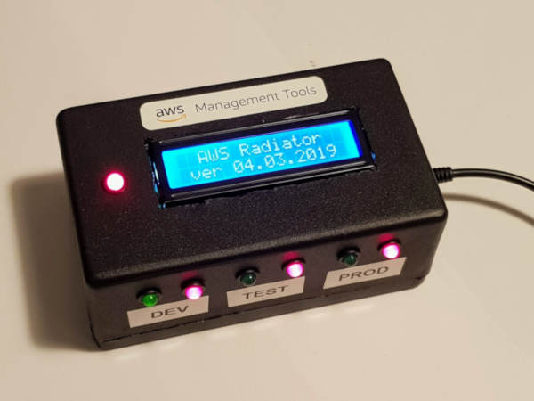

# AWS Radiator Console for the ESP8266
## Introduction
The Radiator Console is used to monitor the AWS cloud service alarms and code pipeline status. The console contains Led lights and LCD screen to show the AWS status messages. The backend service for the console is a custom AWS Lambda function that provides a dedicated REST JSON response. [Link to the Lambda repository](https://github.com/m1kma/radiator-console-backend)

My implementaion is built on top of the AWS but the backend can be virtually any REST service that provides a suitable JSON response.



## Compatibility
This program is intended to run on the ESP8266 based boards. My version uses NodeMCU 1.0 board.

## Components
The Radiator Console contains following components:
* 1 x NodeMCU board
* 7 x Led lamps (4 x red and 3 x green blinking)
* 7 x Resistors for the leds
* 1 x LCD screen 2x16 I2C

## JSON content
The JSON content for the console looks like this:

```json
{
    "alarms_list": [],
    "alarms_raised": false,
    "alarms_raised_history": true,
    "pipelines_running": false,
    "pipelines_running_list": [],
    "pipelines_failed": true,
    "pipelines_failed_list": [
        "CodeBuildPipeline"
    ]
}
```

## Credits
Copyright (c) 2019 Mika Mäkelä


